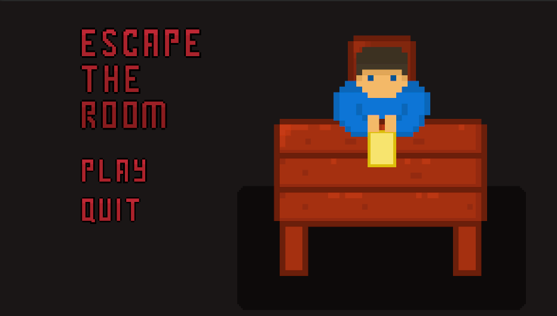
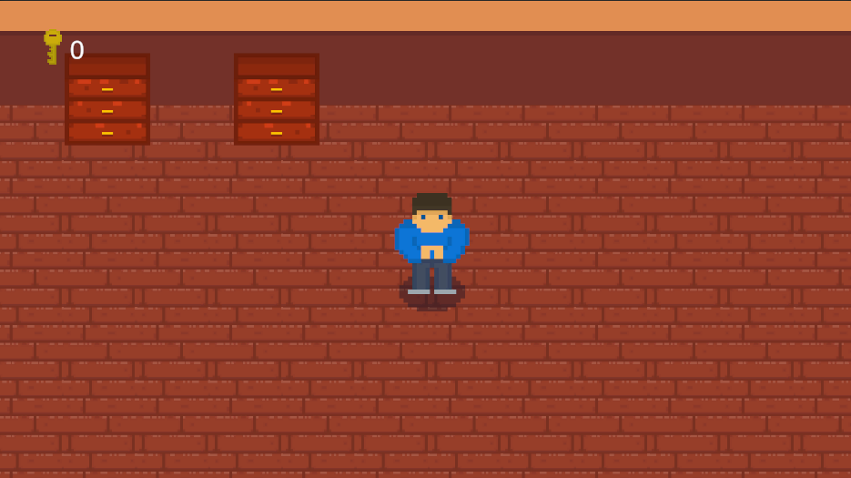
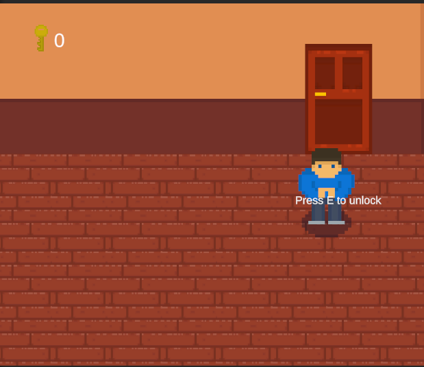
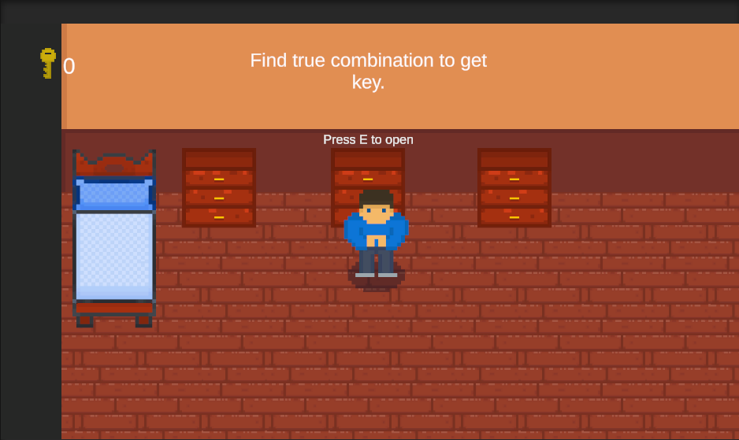
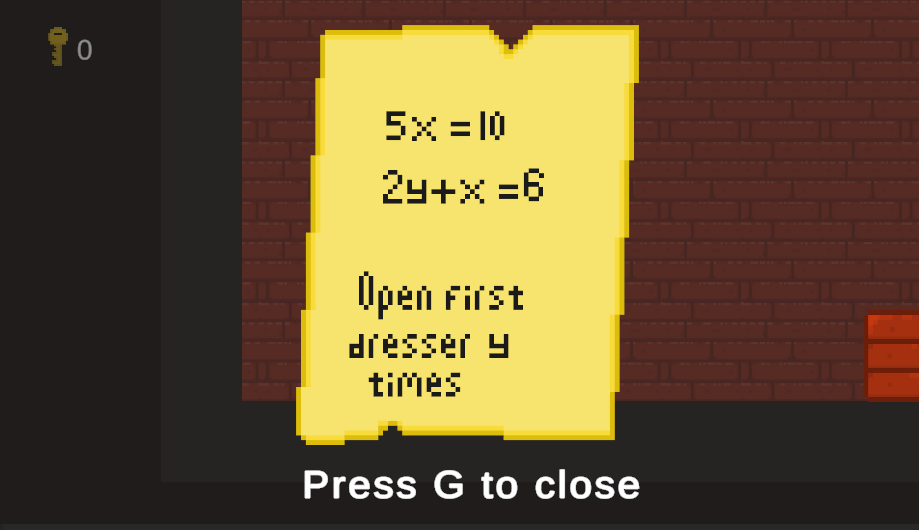
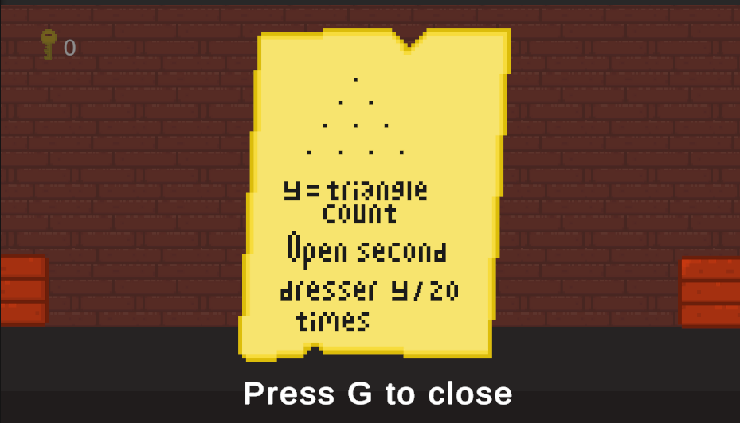
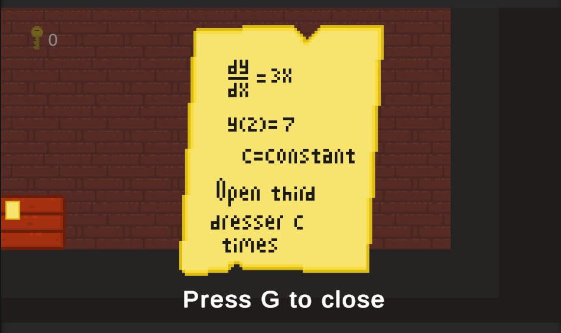
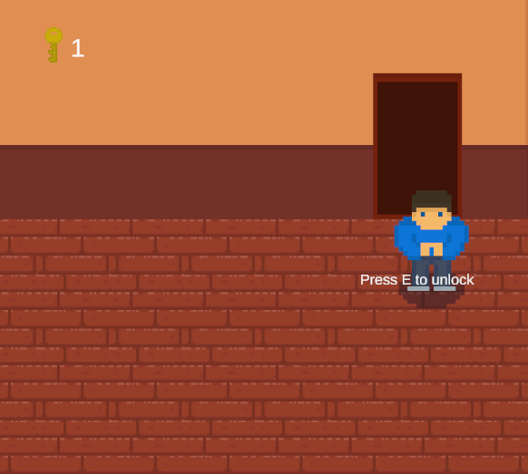
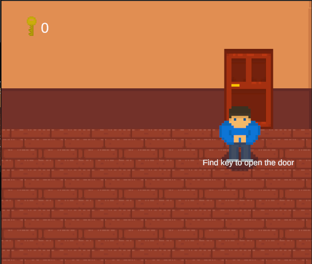
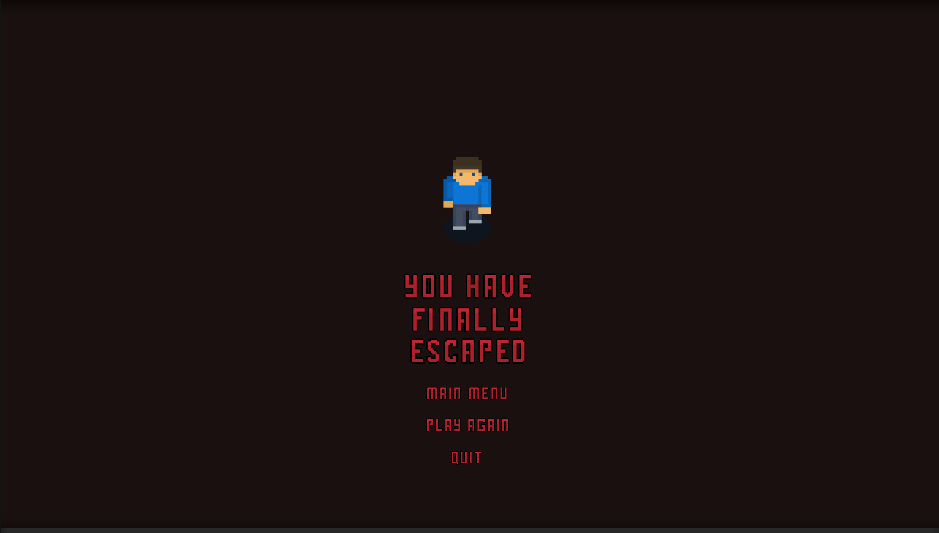

# Purpose Of The Game
> ### You are trapped in a room that you must escape. If you check the objects surrounding you, you may recognize that these are the 'key objects'. Interact with them to escape. Below this description, you will find the way to escape the room.

 
 
 
 
 
 
 
 
 
 
 
 
 
 
 
 
 
 
 
 
 

### Intro of the game
> This is the openning of the game and does not containing many things. Just proceed or leave.
 

 
 
 

### Beginning
> At the beginning you will see some objects that you must interact with.
> Let's find out what will be happen when interact with them.

 

### The Door 

> The door is the bridge between you and freedom. You must find the key to open it.

 

### Dressers

> Dressers are the main objects to find the correct combination and open the door with them.  You can interact with them by pressing E and G.

 

### Incorrect Combination

> There is only one correct combination. If you enter an incorrect combination the instruction above will warn you. That will make the situation you are in more understandable.

 

### Correct Combination

> If you enter the correct combination the key count will turn into "1". After that, you can go to open the door, but for now, this is not possible with the information we have.

 

### First Question

> When you solve the first question it will give you how many times you need to open the first dresser.
> As you can see first question is a linear equation in two variables.

 

### Second Question

> When you solve the second question it will give you how many times you need to open the second dreseer.  
> The second question is a combination problem. It might be difficult for some people so here's a tip for you. First, choose two line. If you choose two poin from the line above you must choose one point from the line below,if you choose two point from the line below you must choose one point from the line above 

 

### Third Question 

> When you solve the third question it will give you how many times you need to open the third dreseer.  
> The third question is a basic differential equation. I think everyone can solve it with the help of the internet.

 

### To The End Of The Game

> If you're reading this step, you might have the key, so you can open the door now.

 

  

> If you don't have the key, the door won't open, so don't even try.

 

### Finaly Escaped

> Finally, you have escaped, and there are no more tips for you. Congratulations! You can choose to play again, or you can leave. It's up to you.

 

